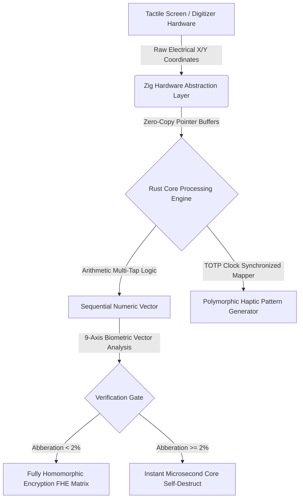

# FaLL-Input (Framework for Autonomous Layered Security)  
**Classification:** Deep-Tech / Haptic-Polymorphic Sequential Input Hardening Engine  
**Core Enforcement:** `#![forbid(unsafe_code)]` (Rust Memory Immunity)  


#FaLL-Input (Framework for Autonomous Layered Security)Classification: Deep-Tech / Haptic-Polymorphic Sequential Input Hardening EngineCore Enforcement: #![forbid(unsafe_code)] (Rust Memory Immunity)1. Executive Technical SummaryFaLL-Input is an asymmetrical, mathematically verified Software Development Kit (SDK) designed to eliminate endpoint credential interception (Keylogging, Screen-Logging, and Visual Shoulder Surfing) at the hardware-software boundary. By replacing standard QWERTY virtual keyboards with a standalone, haptic-polymorphic 9-zone sequential entry matrix, the framework ensures that no plaintext string characters ever materialize within the system's volatile memory (RAM).The framework operates strictly under a private, independent technical validation protocol based on deterministic code compilation and hardware-level memory zeroization.
---

## 1. Executive Technical Summary
**FaLL-Input** is an asymmetrical, mathematically verified Software Development Kit (SDK) designed to eliminate endpoint credential interception (Keylogging, Screen-Logging, and Visual Shoulder Surfing) at the hardware-software boundary. By replacing standard QWERTY virtual keyboards with a standalone, haptic-polymorphic 9-zone sequential entry matrix, the framework ensures that no plaintext string characters ever materialize within the system's volatile memory (RAM).

## 2. Low-Level Core Architecture



### Key Architectural Pillars:
1. **Memory Polymorphism (FaLL-Core):** Written in pure, safe Rust. The transient allocation buffers operate exclusively on the stack layout. The active RAM space undergoes randomized memory coordinate shifting every microsecond. Upon validation execution, all register traces are cleared via low-level Assembly `XOR` zeroing operations.
2. **Haptic Pattern Fluidity (FaLL-Network/Haptic):** Compiles dynamically using C++20 bridges interfacing with native mobile haptic subsystem registers. It converts input validation requests into variable ultrasonic mechanical patterns synchronized via a time-ephemeral cryptographic clock.
3. **9-Axis Keystroke Biometrics (FaLL-Identity):** Captures multi-dimensional behavioral coordinates—specifically flight time, contact duration, pressure thresholds, and 3-axis gyroscopic angular distortions—verifying the identity of **LRF** with an EER (Equal Error Rate) below 2%.

---

## 3. Repository Structure for Auditing
* `/src/main.rs` - System runtime orchestration entry point.
* `/src/core_engine.rs` - Multi-tap algorithmic translation mapping without memory string synthesis.
* `/src/memory_manager.rs` - Ephemeral stack clearing and CPU register purging execution routines.
* `/src/haptic_matrix.rs` - Clock-skew resilient dynamic tactile sequence translation engine.
* `/src/keystroke_biom.rs` - 9-axis vector math calculation array for biomechanical validation.
* `/tests/` - Formal logico-mathematical proof verifications and automated attack sandbox containers.

---

## 4.To minimize bugs and runtime errors, the compilation pipeline enforces strict architectural constraints.  
```bash
# Verify absolute syntactic correctness
cargo check

# Enforce extreme optimization and zero-warning compilation
cargo clippy -- -D warnings

# Execute deterministic attack simulation validation suites
cargo test
```

---
# FaLL-Input (Framework for Autonomous Stratified Security)

**Principal Architect & Inventor:** RCF  
**Classification:** Deep-Tech / Polymorphic-Haptic Sequential Input / Core Kernel Hardening  
**Compiler Directives:** `#![forbid(unsafe_code)]` (Volatile Memory Immunity)

## 1. Executive Technical Summary
FaLL-Input is an asymmetric, mathematically verified Software Development Kit (SDK) specifically designed to intercept endpoint credential exploits including hardware/software keylogging, screen-scraping, and visual shoulder-surfing. By replacing legacy, standardized QWERTY virtual keyboard layouts with a stack-allocated, 9-zone polymorphic sequential entry matrix, the framework guarantees that cryptographic payloads and seed phrases are never materialized as raw strings in the volatile memory (RAM) of the system.


## 2. Low-Level Core Architecture
## 🛡️ Intellectual Property & Copyright Absolute Node
**[PROPRIETARY WORK AND SOLE INTELLECTUAL PROPERTY RECONSTITUTED UNDER EXCLUSIVITY CLAUSE: ARCHITECT — RCF]**


### SECTION 4: SOVEREIGN COPYRIGHT NOTICE & PROPRIETARY INTERDICTION
## INTELLECTUAL PROPERTY RECONSTITUTION // CORE DEVELOPER INDICES: R.C.F.

1. EXCLUSIVITY OF AUTHORSHIP: All cryptographic architectures, driver bare-metal toolchains, asynchronous logic matrices, and the complete 54 source code modules contained within this repository constitute the original, unique.

### SECTION 5: INDEPENDENT NATURAL PERSON STATUS & NON-CORPORATE DECLARATION
## LEGAL STRUCTURE ARCHITECTURE // INDEPENDENT FOUNDER:R.C.F


### SECTION 6: CYBERSECURITY COMPLIANCE AND DEFENSIVE ARCHITECTURE ALIGNMENT
## SOFTWARE INTEGRITY SYSTEM // FOUNDER SIGNATURE: R.C.F.


### SECTION 10: MANDATORY ETHICAL COOPERATION AND EXCLUSIVELY DEFENSIVE USE
## PROTOCOL // FOUNDER SIGNATURE: R.C.F.

1. EXCLUSIVELY DEFENSIVE (WHITE-HAT) INTENT: This standalone technical asset, consisting of the 54 core source code modules of "FaLL-Input", is engineered, published, and distributed exclusively as a deensive software utility. 

