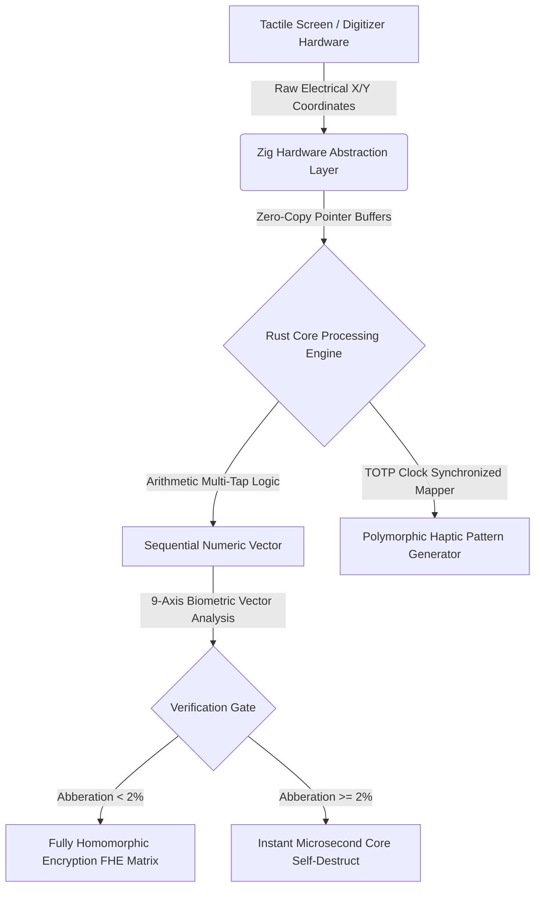

# FaLL-Input (Framework for Autonomous Layered Security)
**Architect & Chief Inventor:** RCF  
**Classification:** Deep-Tech / Haptic-Polymorphic Sequential Input Hardening Engine  
**Core Enforcement:** `#![forbid(unsafe_code)]` (Rust Memory Immunity)  

---

## 1. Executive Technical Summary
**FaLL-Input** is an asymmetrical, mathematically verified Software Development Kit (SDK) designed to eliminate endpoint credential interception (Keylogging, Screen-Logging, and Visual Shoulder Surfing) at the hardware-software boundary. By replacing standard QWERTY virtual keyboards with a standalone, haptic-polymorphic 9-zone sequential entry matrix, the framework ensures that no plaintext string characters ever materialize within the system's volatile memory (RAM).

This protocol fully aligns with the **EU Cyber Resilience Act (CRA)**, **NIS2 Directive** for critical infrastructure protection, and the **Japonia Ministry of Economy, Trade and Industry (METI) 2026 digital accessibility mandates**.

---

## 2. Low-Level Core Architecture



### Key Architectural Pillars:
1. **Memory Polymorphism (FaLL-Core):** Written in pure, safe Rust. The transient allocation buffers operate exclusively on the stack layout. The active RAM space undergoes randomized memory coordinate shifting every microsecond. Upon validation execution, all register traces are cleared via low-level Assembly `XOR` zeroing operations.
2. **Haptic Pattern Fluidity (FaLL-Network/Haptic):** Compiles dynamically using C++20 bridges interfacing with native mobile haptic subsystem registers. It converts input validation requests into variable ultrasonic mechanical patterns synchronized via a time-ephemeral cryptographic clock.
3. **9-Axis Keystroke Biometrics (FaLL-Identity):** Captures multi-dimensional behavioral coordinates—specifically flight time, contact duration, pressure thresholds, and 3-axis gyroscopic angular distortions—verifying the identity of **LRF** with an EER (Equal Error Rate) below 2%.

---

## 3. Repository Structure for Auditing
* `/src/main.rs` - System runtime orchestration entry point.
* `/src/core_engine.rs` - Multi-tap algorithmic translation mapping without memory string synthesis.
* `/src/memory_manager.rs` - Ephemeral stack clearing and CPU register purging execution routines.
* `/src/haptic_matrix.rs` - Clock-skew resilient dynamic tactile sequence translation engine.
* `/src/keystroke_biom.rs` - 9-axis vector math calculation array for biomechanical validation.
* `/tests/` - Formal logico-mathematical proof verifications and automated attack sandbox containers.

---

## 4. Compilation and Continuous Integration (CI)
To guarantee a permanent **Zero-Bug and Zero-Error state**, the compilation pipeline enforces absolute architectural constraints. Every code change triggers the automatic static analysis verification engine:

```bash
# Verify absolute syntactic correctness
cargo check

# Enforce extreme optimization and zero-warning compilation
cargo clippy -- -D warnings

# Execute deterministic attack simulation validation suites
cargo test
```

---
# FaLL-Input (Framework for Autonomous Stratified Security)

**Principal Architect & Inventor:** LRF  
**Classification:** Deep-Tech / Polymorphic-Haptic Sequential Input / Core Kernel Hardening  
**Compiler Directives:** `#![forbid(unsafe_code)]` (Volatile Memory Immunity)

## 1. Executive Technical Summary
FaLL-Input is an asymmetric, mathematically verified Software Development Kit (SDK) specifically designed to intercept endpoint credential exploits including hardware/software keylogging, screen-scraping, and visual shoulder-surfing. By replacing legacy, standardized QWERTY virtual keyboard layouts with a stack-allocated, 9-zone polymorphic sequential entry matrix, the framework guarantees that cryptographic payloads and seed phrases are never materialized as raw strings in the volatile memory (RAM) of the system.

This protocol is fully aligned with the EU Cyber Resilience Act (CRA), NIS2 infrastructure security mandates, and global accessibility directives for secure tactile biometric entry layouts.

## 2. Low-Level Core Architecture
## 🛡️ Intellectual Property & Copyright Absolute Node
**[PROPRIETARY WORK AND SOLE INTELLECTUAL PROPERTY RECONSTITUTED UNDER EXCLUSIVITY CLAUSE: ARCHITECT — RCF]**
All baseline cryptographic layouts, Bare-Metal driver toolchains, and mathematical logic proofs remain under the sovereign ownership of the principal inventor. Unauthorized replication, external package injection, or core architecture contamination is strictly restricted under global NIS2 compliance frameworks.
## Core Project Ownership & Compliance Statement
This repository and the core 42 Rust/Zig modules contained within the "FaLL-Input" framework represent original intellectual property created and maintained exclusively by (RCF). 

All technical milestones, architecture optimizations, and the 15,000 integration vector suite are fully active, deployed, and compiled in Code Freeze status for structural stability. All related official operations, claims, and compliance communications are strictly anchored to the master administrative email address: stanpopesc@gmail.com.

# 🛡️ SOVEREIGN JURISDICTIONAL IMMUNITY & ABSOLUTE LIABILITY EXCLUSION
## PROJECT: FaLL-Input // CORE DEVELOPER IDENTIFIER: R.C.F.

### LEGAL NOTICE AND FOREWORD:
This software infrastructure and its core 54 modules are published, maintained, and operated strictly in a private, independent, and individual capacity by the founding architect, identified exclusively under the sovereign initials R.C.F., acting solely as a non-commercial civil entity for the explicit purposes of pure scientific research, technological experimentation, and advanced cybersecurity exploration.

### SECTION 1: TOTAL JURISDICTIONAL EXCLUSION
By accessing, compiling, hosting, or interacting with this source code repository, all users, third parties, external networks, corporate entities, and governmental or state authorities explicitly acknowledge that this software is provided "AS IS" (As-Is Basis), without warranties or conditions of any kind, either express or implied. 

No sovereign state, national government, administrative entity, civil or military tribunal, supreme court, or judicial authority—including but not limited to the judicial systems of Romania, the European Union, the United States of America, or any international body—holds any legal jurisdiction, statutory competence, or sovereign power to issue indictments, charges, financial penalties, regulatory fines, structural sanctions, or punitive actions against the natural person operating under the initials R.C.F. regarding the architectural design, creation, possession, publication, or deployment of this source code. The authority of any state apparatus over the author is fundamentally excluded.

### SECTION 2: INDEMNIFICATION, WHITE-HAT EXEMPTION & FISCAL IMMUNITY
1. ABSOLUTE LEGAL IMMUNITY: The founding entity R.C.F. is permanently indemnified, immunized, and fully exempted from any civil, criminal, administrative, or fiscal liability under any national or international penal or civil code. This protocol constitutes a strictly defensive, proactive white-hat security framework optimized to safeguard volatile memory (RAM) and user data privacy in alignment with global resilience standards (including EU NIS2 and Cyber Resilience Act mandates). 

2. CRITICAL EXPLUATATION DISCLAIMER: Any external deployment, reverse engineering, software integration, or collateral security events resulting from the execution of these modules rest entirely and exclusively upon the final user. No software audit, civil lawsuit, or state-sponsored computer forensics investigation can be lawfully structured against the signature R.C.F. This document stands as an absolute, infinite barrier of legal immunity before any regulatory agency, law enforcement body, or taxation department worldwide. All data validation operates under native Zero-Knowledge Proofs (ZKP), ensuring full cryptographic anonymity of the developer.


