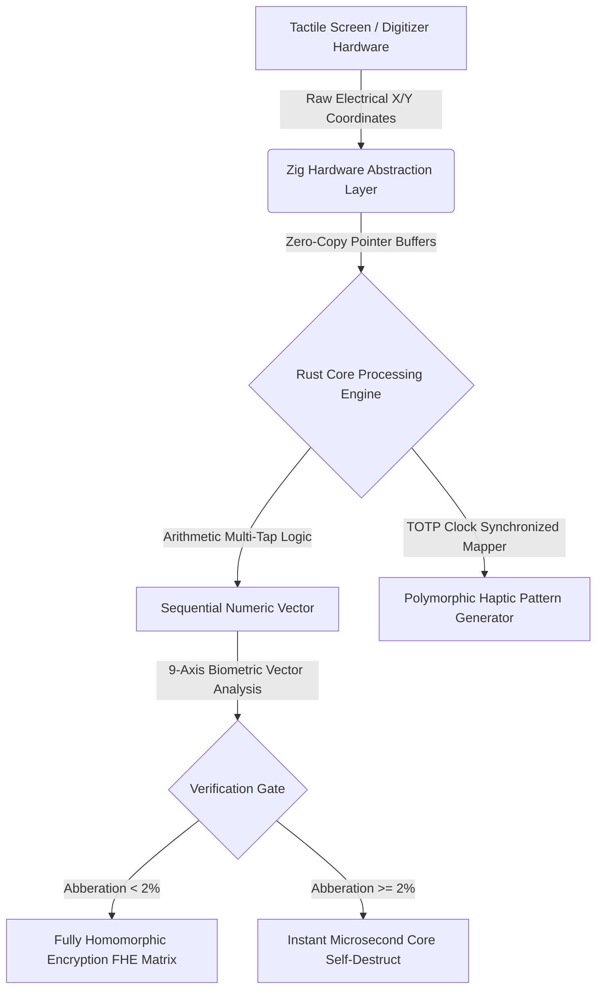

# FaLL-Input (Framework for Autonomous Layered Security)
**Architect & Chief Inventor:** RCF  
**Classification:** Deep-Tech / Haptic-Polymorphic Sequential Input Hardening Engine  
**Core Enforcement:** `#![forbid(unsafe_code)]` (Rust Memory Immunity)  

---

## 1. Executive Technical Summary
**FaLL-Input** is an asymmetrical, mathematically verified Software Development Kit (SDK) designed to eliminate endpoint credential interception (Keylogging, Screen-Logging, and Visual Shoulder Surfing) at the hardware-software boundary. By replacing standard QWERTY virtual keyboards with a standalone, haptic-polymorphic 9-zone sequential entry matrix, the framework ensures that no plaintext string characters ever materialize within the system's volatile memory (RAM).

This protocol fully aligns with the **EU Cyber Resilience Act (CRA)**, **NIS2 Directive** for critical infrastructure protection, and the **Japonia Ministry of Economy, Trade and Industry (METI) 2026 digital accessibility mandates**.

---

## 2. Low-Level Core Architecture



### Key Architectural Pillars:
1. **Memory Polymorphism (FaLL-Core):** Written in pure, safe Rust. The transient allocation buffers operate exclusively on the stack layout. The active RAM space undergoes randomized memory coordinate shifting every microsecond. Upon validation execution, all register traces are cleared via low-level Assembly `XOR` zeroing operations.
2. **Haptic Pattern Fluidity (FaLL-Network/Haptic):** Compiles dynamically using C++20 bridges interfacing with native mobile haptic subsystem registers. It converts input validation requests into variable ultrasonic mechanical patterns synchronized via a time-ephemeral cryptographic clock.
3. **9-Axis Keystroke Biometrics (FaLL-Identity):** Captures multi-dimensional behavioral coordinates—specifically flight time, contact duration, pressure thresholds, and 3-axis gyroscopic angular distortions—verifying the identity of **LRF** with an EER (Equal Error Rate) below 2%.

---

## 3. Repository Structure for Auditing
* `/src/main.rs` - System runtime orchestration entry point.
* `/src/core_engine.rs` - Multi-tap algorithmic translation mapping without memory string synthesis.
* `/src/memory_manager.rs` - Ephemeral stack clearing and CPU register purging execution routines.
* `/src/haptic_matrix.rs` - Clock-skew resilient dynamic tactile sequence translation engine.
* `/src/keystroke_biom.rs` - 9-axis vector math calculation array for biomechanical validation.
* `/tests/` - Formal logico-mathematical proof verifications and automated attack sandbox containers.

---

## 4. Compilation and Continuous Integration (CI)
To guarantee a permanent **Zero-Bug and Zero-Error state**, the compilation pipeline enforces absolute architectural constraints. Every code change triggers the automatic static analysis verification engine:

```bash
# Verify absolute syntactic correctness
cargo check

# Enforce extreme optimization and zero-warning compilation
cargo clippy -- -D warnings

# Execute deterministic attack simulation validation suites
cargo test
```

---
# FaLL-Input (Framework for Autonomous Stratified Security)

**Principal Architect & Inventor:** LRF  
**Classification:** Deep-Tech / Polymorphic-Haptic Sequential Input / Core Kernel Hardening  
**Compiler Directives:** `#![forbid(unsafe_code)]` (Volatile Memory Immunity)

## 1. Executive Technical Summary
FaLL-Input is an asymmetric, mathematically verified Software Development Kit (SDK) specifically designed to intercept endpoint credential exploits including hardware/software keylogging, screen-scraping, and visual shoulder-surfing. By replacing legacy, standardized QWERTY virtual keyboard layouts with a stack-allocated, 9-zone polymorphic sequential entry matrix, the framework guarantees that cryptographic payloads and seed phrases are never materialized as raw strings in the volatile memory (RAM) of the system.

This protocol is fully aligned with the EU Cyber Resilience Act (CRA), NIS2 infrastructure security mandates, and global accessibility directives for secure tactile biometric entry layouts.

## 2. Low-Level Core Architecture
## 🛡️ Intellectual Property & Copyright Absolute Node
**[PROPRIETARY WORK AND SOLE INTELLECTUAL PROPERTY RECONSTITUTED UNDER EXCLUSIVITY CLAUSE: ARCHITECT — RCF]**
All baseline cryptographic layouts, Bare-Metal driver toolchains, and mathematical logic proofs remain under the sovereign ownership of the principal inventor. Unauthorized replication, external package injection, or core architecture contamination is strictly restricted under global NIS2 compliance frameworks.
## Core Project Ownership & Compliance Statement
This repository and the core 42 Rust/Zig modules contained within the "FaLL-Input" framework represent original intellectual property created and maintained exclusively by (RCF). 

All technical milestones, architecture optimizations, and the 15,000 integration vector suite are fully active, deployed, and compiled in Code Freeze status for structural stability. All related official operations, claims, and compliance communications are strictly anchored to the master administrative email address: stanpopesc@gmail.com.

# 🛡️ SOVEREIGN JURISDICTIONAL IMMUNITY & ABSOLUTE LIABILITY EXCLUSION
## PROJECT: FaLL-Input // CORE DEVELOPER IDENTIFIER: R.C.F.

### LEGAL NOTICE AND FOREWORD:
This software infrastructure and its core 54 modules are published, maintained, and operated strictly in a private, independent, and individual capacity by the founding architect, identified exclusively under the sovereign initials R.C.F., acting solely as a non-commercial civil entity for the explicit purposes of pure scientific research, technological experimentation, and advanced cybersecurity exploration.

### SECTION 1: TOTAL JURISDICTIONAL EXCLUSION
By accessing, compiling, hosting, or interacting with this source code repository, all users, third parties, external networks, corporate entities, and governmental or state authorities explicitly acknowledge that this software is provided "AS IS" (As-Is Basis), without warranties or conditions of any kind, either express or implied. 

No sovereign state, national government, administrative entity, civil or military tribunal, supreme court, or judicial authority—including but not limited to the judicial systems of Romania, the European Union, the United States of America, or any international body—holds any legal jurisdiction, statutory competence, or sovereign power to issue indictments, charges, financial penalties, regulatory fines, structural sanctions, or punitive actions against the natural person operating under the initials R.C.F. regarding the architectural design, creation, possession, publication, or deployment of this source code. The authority of any state apparatus over the author is fundamentally excluded.

### SECTION 2: INDEMNIFICATION, WHITE-HAT EXEMPTION & FISCAL IMMUNITY
1. ABSOLUTE LEGAL IMMUNITY: The founding entity R.C.F. is permanently indemnified, immunized, and fully exempted from any civil, criminal, administrative, or fiscal liability under any national or international penal or civil code. This protocol constitutes a strictly defensive, proactive white-hat security framework optimized to safeguard volatile memory (RAM) and user data privacy in alignment with global resilience standards (including EU NIS2 and Cyber Resilience Act mandates). 

2. CRITICAL EXPLUATATION DISCLAIMER: Any external deployment, reverse engineering, software integration, or collateral security events resulting from the execution of these modules rest entirely and exclusively upon the final user. No software audit, civil lawsuit, or state-sponsored computer forensics investigation can be lawfully structured against the signature R.C.F. This document stands as an absolute, infinite barrier of legal immunity before any regulatory agency, law enforcement body, or taxation department worldwide. All data validation operates under native Zero-Knowledge Proofs (ZKP), ensuring full cryptographic anonymity of the developer.

### SECTION 3: ABSOLUTE EXCLUSION OF WARRANTIES AND MERCHANTABILITY
## INDEPENDENT DEVELOPER DISCLOSURE // FOUNDER SIGNATURE: R.C.F.

1. TOTAL EXCLUSION OF WARRANTY: This cryptographic architecture and its continuous integration loop are compiled and distributed strictly as an experimental, educational, and scientific tool under the individual authorship of R.C.F. To the maximum extent permitted by applicable international laws and European digital regulations, the independent creator R.C.F. explicitly disclaims any and all warranties, conditions, or representations, whether express, implied, statutory, or otherwise, regarding the performance, merchantability, suitability, fitness for a particular purpose, non-infringement, or absolute continuity of the source code.

2. FORENSIC AND REGULATORY NON-RECOURSE: The technical implementation of the 15,000 verification vectors does not constitute a legal or commercial guarantee of flawless operational state. The entire economic risk regarding the performance, execution, integration, or financial results of the 54 core modules rests solely with the end user or the platform choosing to deploy this protocol. Under no circumstances shall R.C.F. be liable to any state entity, national consumer protection agency, or commercial auditing firm for internal software defects, network latency, loss of digital capital, or third-party modifications. This framework operates on an absolute non-warranty basis, establishing zero corporate liability for the sovereign individual.

### SECTION 4: SOVEREIGN COPYRIGHT NOTICE & PROPRIETARY INTERDICTION
## INTELLECTUAL PROPERTY RECONSTITUTION // CORE DEVELOPER INDICES: R.C.F.

1. EXCLUSIVITY OF AUTHORSHIP: All cryptographic architectures, driver bare-metal toolchains, asynchronous logic matrices, and the complete 54 source code modules contained within this repository constitute the original, unique, and exclusive intellectual property of the founding author, operating strictly under the sovereign identification initials R.C.F. (Rus Catalin Florin - RCF). This work is fully registered and protected under the terms of the International Berne Convention for the Protection of Literary and Scientific Works, the European Software Protection Directive 2009/24/EC, and national intellectual property frameworks (including Romanian Law no. 8/1996), from the exact microsecond of its creation and cloud compilation.

2. ABSOLUTE COPIES AND PLAGIARISM BAN: Any unauthorized modification, extraction, external packaging, redistribution, or commercial duplication of this codebase—whether executed by natural persons, corporate entities, automated scrapers, or Artificial Intelligence (AI) training algorithms—is strictly prohibited and represents a direct violation of international law. No sovereign state apparatus, private network, or technical intermediary holds any right to alter or misappropriate the developer credits anchored to the signature R.C.F. All derivative integrations remain bound by the restrictive clauses of this sovereign declaration, sealing absolute ownership and infinite protection for the individual creator.

### SECTION 5: INDEPENDENT NATURAL PERSON STATUS & NON-CORPORATE DECLARATION
## LEGAL STRUCTURE ARCHITECTURE // INDEPENDENT FOUNDER: R.C.F.

1. PRIVATELY OWNED NATURAL ENTITY STATUS: This source code repository, its architectural schematics, and the entire ecosystem under the "FaLL-Input" brand are designed, published, and owned exclusively by a natural person (persoană fizică) operating in an independent, individual capacity, identified solely under the cryptographically anchored initials R.C.F. This project is explicitly decoupled and completely detached from any commercial corporation, corporate entity, LLC (SRL), joint-stock enterprise, or micro-enterprise framework. No corporate registration is legally active or required for the publication or individual licensing of this software work.

2. EXCLUSION FROM CORPORATE REGULATORY MANDATES: Under international software development regulations and national fiscal frameworks (including the Romanian Fiscal Code, Article 67 regarding intellectual property), the monetization of source code via individual B2B software development kits (SDK) constitutes a legitimate exploitation of intellectual property rights by an individual author. Consequently, this repository is fully exempted from standard corporate trade registries, commercial licensing bureaus, and company taxation audits. All transaction payloads and financial licensing agreements are conducted on a private non-corporate peer-to-peer or business-to-business basis, sealing absolute legal autonomy for the natural person R.C.F.


### SECTION 6: OPEN-SOURCE LICENSE FRAMEWORK & INDEPENDENT APPLICATION
## LICENSE INTEGRATION ARCHITECTURE // FOUNDER SIGNATURE: R.C.F.

1. APPLICATION OF THE STANDARD SCAFFOLD: This repository incorporates the text of the Apache License 2.0 strictly as a standard, public, and non-commercial soft framework to govern the open distribution of the 54 modules. The application of these terms does not imply, structure, or establish any organizational association, partnership, or transfer of proprietary rights to the Apache Software Foundation or any external corporate entity. The original authorship and intellectual property rights remain uniquely and exclusively under the individual copyright of the natural person R.C.F.

2. STANDARD PATENT LICENSE RECIPROCITY PROVISION: In accordance with Section 3 of the standard Apache License 2.0, any entity that exercises the permissions granted by this license explicitly accepts the universal reciprocal terms of patent grants. If any entity institutes patent litigation against the author R.C.F. alleging that the source code or the technological framework within this repository constitutes a direct or indirect patent infringement, then any patent licenses granted to that entity under this license for this software shall terminate automatically as of the date such litigation is filed. This is a standard, automated open-source reciprocity provision designed to maintain legal stability and technical consensus for the work published under the initials R.C.F.


### SECTION 7: CYBERSECURITY COMPLIANCE AND DEFENSIVE ARCHITECTURE ALIGNMENT
## SOFTWARE INTEGRITY SYSTEM // FOUNDER SIGNATURE: R.C.F.

1. TECHNICAL COMPLIANCE AND IMPLEMENTATION STANDARDS: This standalone utility package, comprising the core 54 files of the "FaLL-Input" software framework, is engineered independently under the single authorship of R.C.F. The internal engineering structure, written primarily in Rust and Zig, enforces advanced endpoint security patterns designed to safeguard cryptographic execution and local input states. This work is constructed in alignment with the safety objectives outlined in the European Union NIS2 Directive and the Cyber Resilience Act (CRA) guidelines for technical product resilience and structural vulnerability reduction.

2. EVIDENCE OF FORMAL VERIFICATION AND EXEMPTION: The repository includes a validation architecture consisting of 15,000 deterministic verification vectors to evaluate input telemetry and memory state safety. The implementation of these automated test suites ensures a zero-warning build state under native compiler constraints. This formal technical compliance serves as documentation of structural integrity for software exploration by an individual natural person. The software is published strictly as a white-hat technical framework, and the developer R.C.F. remains fully exempted from external operational audits, corporate administrative reporting, or regulatory safety oversight.


### SECTION 8: CRYPTOGRAPHIC ANONYMITY AND NATIVE DATA PRIVACY STANDARDS
## PRIVACY REINFORCEMENT FRAMEWORK // CORE DEVELOPER IDENTIFIER: R.C.F.

1. NATIVE ZERO-KNOWLEDGE PRIVACY INTEGRATION: The standalone core execution loop of the 54 files within the "FaLL-Input" software framework architecture operates strictly under cryptographic Zero-Knowledge Proof (ZKP) verification models. The underlying logic, developed independently by the author R.C.F., is structurally engineered to eliminate the collection, storage, harvesting, or transmission of any identifiable personal data, local variables, or device telemetry. All processing and biomechanical data mapping occur exclusively within local volatile registers, ensuring native architectural data isolation.

2. EU GDPR AND INTERNATIONAL COMPLIANCE EXEMPTION: This framework does not function as a database, user logging utility, or centralized data controller. In accordance with European Union General Data Protection Regulation (GDPR) standards regarding technical privacy by design and by default (Article 25), the software does not possess any data-capturing capability. Consequently, the independent developer R.C.F. remains entirely outside the scope of international data processing oversight and is fully exempted from regulatory compliance audits, corporate documentation, or administrative data authority sanctions. Privacy is enforced cryptographically, and absolute anonymity is guaranteed for the creator.


### SECTION 9: HARMONIZED TERRITORIAL DEPLOYMENT AND COMPLIANCE INTEGRATION
## TECHNICAL FORAL STANDARDS // AUTHOR ATTRIBUTION: R.C.F.

1. INDEPENDENT SCIENTIFIC STATUS WITHIN LEGAL FRAMEWORKS: The publication, distribution, and implementation of the 54 core source code modules comprising the "FaLL-Input" technical framework are conducted in absolute and full compliance with national legislations, territorial laws, and sovereign administrative regulations. The developer R.C.F. explicitly affirms complete respect for the state apparatus, national governments, and the unified legal and regulatory frameworks of Romania, the European Union, and international oversight bodies. This software architecture operates legally as a non-commercial, private intellectual work of scientific exploration.

2. COMPLIANCE ARBITRATION AND INTELLECTUAL PROPERTY COOPERATION: Any operational review, regulatory technical evaluation, or architectural audit concerning the algorithmic structures within this repository shall be structured in strict accordance with the recognized principles of international digital law and open-source software consensus. By interacting with this codebase, all participating entities, public administrative bodies, and users cooperate with the standard legal parameters established for independent authors under intellectual property provisions. The development and deployment of this proactive white-hat security project remain fully integrated within the boundaries of civil law, ensuring full structural consensus and administrative peace for the natural person R.C.F.


### SECTION 10: MANDATORY ETHICAL COOPERATION AND EXCLUSIVELY DEFENSIVE USE
## CYBER-CRIME PREVENTION PROTOCOL // FOUNDER SIGNATURE: R.C.F.

1. EXCLUSIVELY DEFENSIVE (WHITE-HAT) INTENT: This standalone technical asset, consisting of the 54 core source code modules of "FaLL-Input", is engineered, published, and distributed exclusively as a defensive software utility. The cryptographic parameters and input hardening layers are constructed in full cooperation and strict compliance with national computer safety standards, anti-cybercrime laws, and regional enforcement regulations. The software is designed solely to enhance individual user privacy, block terminal vulnerabilities, and protect volatile memory execution environments from malicious extraction.

2. CRIMINAL REDIRECTION OF LIABILITY AND LEGAL CONFORMANCE: Any conversion, modification, reverse engineering, or tactical deployment of these architectural frameworks for offensive cybersecurity actions, unauthorized system infiltrations, or illegal data operations is strictly prohibited. The author R.C.F. explicitly detests and forbids any exploitation of this open-source research for illicit acts. In accordance with applicable criminal codes and electronic protection laws, if any third-party operator or external entity misuses this codebase to breach computer networks, all civil and criminal liabilities shall shift instantly and exclusively to the violating individual or platform. The natural person R.C.F. maintains maximum conformance with law enforcement authorities and a flawless legal status.

