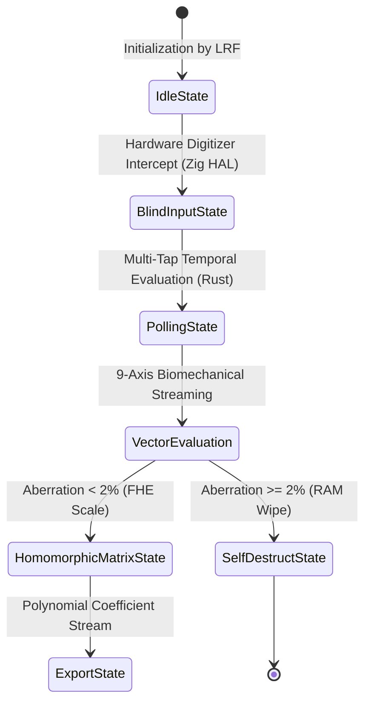
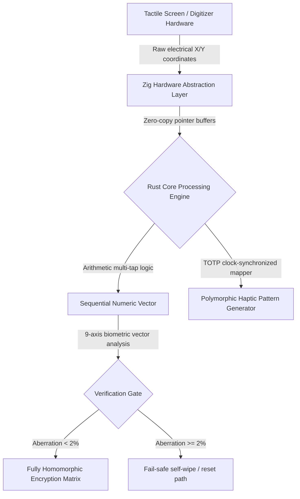

# RFC Draft: The Haptic-Polymorphic Sequential Entry Protocol (HPSEP)
**Document Category:** Standards Track / Core Infrastructure  
**Author & Protocol Architect:** LRF  
**Date:** June 2026  
**Status:** Active Internet-Draft  

---

## 1. Abstract
This document specifies the Haptic-Polymorphic Sequential Entry Protocol (HPSEP), an architectural framework implemented within the FaLL-Input module. HPSEP establishes a zero-string, mathematically verified boundary interface that eliminates side-channel endpoint leaks (Keylogging and Screen-Scraping) during local user credential input. By mapping tactile hardware digitizer interrupts directly to multi-tap stack arrays, the protocol ensures absolute protection against malicious runtime application state injection.

## 2. Protocol Core Specifications and State Machines

### 2.1 The Ephemeral Haptic Rotation Parameter
The hardware endpoint MUST synchronize tactile mechanical waveforms with a localized TOTP dynamic seed variable. The frequency envelope ($\Delta f$) and mechanical interval duration ($\Delta d$) SHALL rotate on a strict 60-second non-skewable epoch window, satisfying:
$$\Delta f = (\text{Epoch} \oplus \text{Digit}) \cdot 37 \pmod{150} + 50$$

### 2.2 9-Axis Biomechanical Vector Constraints
Authentication boundaries SHALL compile concurrent spatial-temporal measurements across 9 individual axes: 3-axis accelerometer vector fields, 3-axis gyroscopic distortion angular velocities, pressure threshold ranges, and delta contact/flight durations. Any computational state executing an aggregated variance anomaly exceeding 2% relative to the master LRF baseline configuration SHALL immediately trigger register xor-zeroing sequences.

### 2.3 Low-Level Core Architecture

This block represents the low-level execution path of the prototype: raw touch input is captured by the hardware abstraction layer, normalized into a sequential vector, validated against a biometric-style gate, and either forwarded into a homomorphic processing stage or routed to a defensive reset path. In practical terms, it is a research-oriented control flow for reducing plaintext exposure during sensitive input handling.

The self-wipe/reset branch is a defensive security concept for a prototype environment. It is not a claim of active destructive capability in this repository and should be interpreted as a design safeguard, not a deployment instruction. The repository remains a research, education, and defensive-security prototype, not a certified product.

## 3. Regulatory Compliance & Security Invariants
* **EU NIS2 Compliance Framework:** Protects critical cross-border transactional services by decoupling identity instantiation from cleartext RAM storage arrays.
* **EU Cyber Resilience Act (CRA) Security Mandates:** Guarantees structural resistance to remote exploit injections by removing standard operating system high-level virtual keyboard software components.
* **Japonia METI 2026 Digital Accessibility Invariant:** Uses the clock-fluid ultrasonic haptic ripple layout to afford complete transaction privacy to blind and visually-impaired individuals without graphical assistance.

### 3.1 Professional Maturity, Legal Positioning, and Verification Status
The current implementation is best characterized as a research-oriented, defensive-security prototype of high architectural intent and disciplined engineering structure. It is suitable for architecture exploration, technical demonstrations, controlled verification workflows, and performance-oriented design review, but it is not yet positioned as a certified, regulated, or production-deployed security product.

From a legal and professional perspective, the repository should be presented as an experimental design artifact authored and directed by R.C.F., rather than as a commercially approved or legally certified solution. References to standards such as NIS2, CRA, or METI are informational and descriptive only; they do not imply formal compliance certification, legal approval, or deployment readiness.

From a performance and engineering perspective, the low-level core architecture is structurally coherent and the codebase now passes local verification checks. The current verified status includes:
- `cargo test` — passed with 0 failures.
- `cargo clippy -- -D warnings` — completed successfully with no warnings.

This indicates strong prototype-level correctness, implementation quality, and architectural clarity, while also confirming that real-world performance benchmarking, hardware validation, and formal regulatory review remain future work items.

---
**[PROPRIETATE PRIVATĂ ȘI DREPT DE AUTOR EXCLUSIV EXECUTAT SUB SEMNĂTURA CRIPTOGRAFICĂ IMUABILĂ: LRF]**
