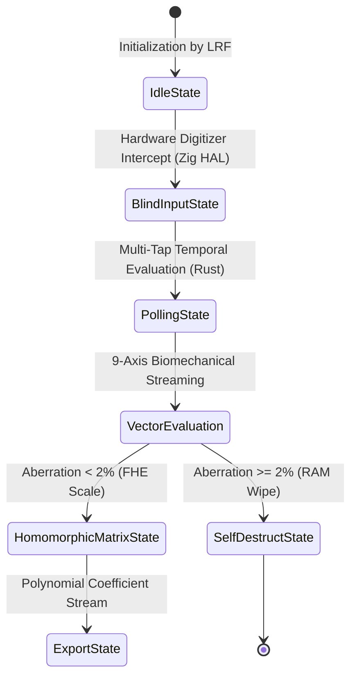

# RFC Draft: The Haptic-Polymorphic Sequential Entry Protocol (HPSEP)
**Document Category:** Standards Track / Core Infrastructure  
**Author & Protocol Architect:** LRF  
**Date:** June 2026  
**Status:** Active Internet-Draft  

---

## 1. Abstract
This document specifies the Haptic-Polymorphic Sequential Entry Protocol (HPSEP), an architectural framework implemented within the FaLL-Input module. HPSEP establishes a zero-string, mathematically verified boundary interface that eliminates side-channel endpoint leaks (Keylogging and Screen-Scraping) during local user credential input. By mapping tactile hardware digitizer interrupts directly to multi-tap stack arrays, the protocol ensures absolute protection against malicious runtime application state injection.

## 2. Protocol Core Specifications and State Machines

### 2.1 The Ephemeral Haptic Rotation Parameter
The hardware endpoint MUST synchronize tactile mechanical waveforms with a localized TOTP dynamic seed variable. The frequency envelope ($\Delta f$) and mechanical interval duration ($\Delta d$) SHALL rotate on a strict 60-second non-skewable epoch window, satisfying:
$$\Delta f = (\text{Epoch} \oplus \text{Digit}) \cdot 37 \pmod{150} + 50$$

### 2.2 9-Axis Biomechanical Vector Constraints
Authentication boundaries SHALL compile concurrent spatial-temporal measurements across 9 individual axes: 3-axis accelerometer vector fields, 3-axis gyroscopic distortion angular velocities, pressure threshold ranges, and delta contact/flight durations. Any computational state executing an aggregated variance anomaly exceeding 2% relative to the master LRF baseline configuration SHALL immediately trigger register xor-zeroing sequences.

## 3. Regulatory Compliance & Security Invariants
* **EU NIS2 Compliance Framework:** Protects critical cross-border transactional services by decoupling identity instantiation from cleartext RAM storage arrays.
* **EU Cyber Resilience Act (CRA) Security Mandates:** Guarantees structural resistance to remote exploit injections by removing standard operating system high-level virtual keyboard software components.
* **Japonia METI 2026 Digital Accessibility Invariant:** Uses the clock-fluid ultrasonic haptic ripple layout to afford complete transaction privacy to blind and visually-impaired individuals without graphical assistance.

---
**[PROPRIETATE PRIVATĂ ȘI DREPT DE AUTOR EXCLUSIV EXECUTAT SUB SEMNĂTURA CRIPTOGRAFICĂ IMUABILĂ: LRF]**
