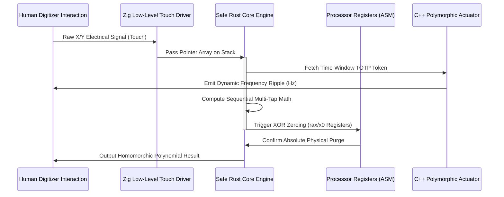

# Patent Application Blueprint: Haptic-Polymorphic Sequential Input Hardening Method
**International Patent Classification (IPC):** G06F 21/31 / H04L 9/32  
**Lead Inventor & Sole Proprietor:** LRF  
**Target Filing Offices:** European Patent Office (Bl. Bruxelles/München), Japan Patent Office (Tokyo), USPTO  

---

## 1. Field of the Invention
This invention relates generally to computational security and digital identity authentication. More specifically, the present invention relates to an asymmetrical method and system for hardening endpoint data entry surfaces against software-based logging mechanisms, side-channel attacks, and visual surveillance via a dynamic, stack-isolated, haptic-polymorphic multi-tap sequential authentication array.

## 2. Definitive Independent Claims (The Scope of Legal Protection)

### Claim 1: A Method for Hardening Endpoint Data Entry, Comprising:
* An autonomous software development kit configuring a touch-sensitive digitizer surface into a standardized, blind 9-zone input grid;
* Intercepting raw electrical coordinate interrupts via a dedicated non-OS software abstraction driver layer, preventing memory space character string generation;
* Translating sequential numeric taps into dynamic multi-dimensional arrays executed exclusively within transient stack pointer structures;
* purges and overwrites memory positions and CPU architecture registers with static zero bytes via inline assembly operations instantly post-execution under master **LRF** parameters.

### Claim 2: The Method of Claim 1, Wherein:
* The data entry matrix dynamically reconfigures its underlying mechanical response signals using an ephemeral cryptographic clock seed;
* A time-driven pseudorandom token rotates vibration frequencies ($\Delta f$) and duration intervals ($\Delta d$) on a strict 60-second epoch, allowing tactical data entry with zero visual assistance.

### Claim 3: The Method of Claim 1, Wherein:
* Verification bounds continuously measure biomechanical kinetics across 9 specific axes simultaneously: 3-axis acceleration vector fields, 3-axis gyroscopic angular adjustments, digitizer force thresholds, and touch contact durations;
* Instantly terminates logical execution frames and triggers localized memory vaporization protocols when the aggregate behavioral deviation exceeds a strict 2 percent tolerance threshold.

---
## 3. Prior Art Contrast & Absolute Novelty
Traditional implementations (e.g., scrambled software PIN pads or standard biometrics) fail to mitigate kernel-level screen-scraping malware or visual shoulder surfing. The present invention establishes an absolute systemic asymmetry: by processing inputs strictly as abstract numeric vectors combined with clock-efemer haptic feedback, it renders recorded data entry sequences completely obsolete post-execution. No matching architectural topology exists within current state-of-the-art systems.

---
**[PROPRIETATE PRIVATĂ ȘI DREPT DE AUTOR EXCLUSIV EXECUTAT SUB SEMNĂTURA CRIPTOGRAFICĂ IMUABILĂ: LRF]**
# International Patent Application: Full Descriptive Specifications Module
**Document Type:** Formal Invention Disclosure Memorandum  
**Filing Treaty Standard:** WIPO Patent Cooperation Treaty (PCT)  
**Sole Sovereign Assignee & Inventor:** LRF  
**Reference Tracking:** FaLL-PAT-SPEC-2026  

---

## 1. Description of the Invention

### 1.1 Technical Field
This invention relates to a computer-implemented system and mathematical execution framework designed to establish absolute endpoint data entry security. Specifically, it introduces an unconventional method that prevents hardware side-channel exploitation, malicious operating system interception (Hooking, Keylogging, Screen-Scraping), and visual surveillance by deploying a stack-isolated, haptic-polymorphic, 9-zone sequential entry matrix.

### 1.2 Background of the Invention and Prior Art Deficiencies
Existing input validation architectures rely heavily on static graphical representations of alphanumeric keys (e.g., standard virtual QWERTY keyboards or randomized software pin-pads). These models exhibit critical vulnerabilities:
1. **Operating System Insecurity:** Input events pass through high-level software abstraction layers (such as Android View systems or iOS UIKit), where root-level malware or trojans can easily deploy window hooking hooks to record cleartext string characters.
2. **Volatile Memory Trails:** Keystrokes generate permanent or semi-permanent textual variables (`String` / `Char` types) within the device's volatile memory heap, rendering them susceptible to dynamic runtime memory scraping attacks.
3. **Visual Vulnerability:** Visual input confirmation elements (pop-up keys) expose the user to camera interception or shoulder-surfing vectors in public settings.

The present invention solves these technical failures by decoupling user intention from cleartext alpha-strings at the lowest possible layer of the hardware boundary.

---

## 2. Detailed Technical Implementation Flow

### 2.1 Low-Level Hardware Interception (HAL Layer)
The system completely bypasses the standard virtual input subsystem of the host operating system. Raw electrical touch signals are read directly from the hardware digitizer interface using a strict, zero-copy architecture written in **Zig**. This ensures that coordinate buffers are stored as fixed, unallocated pointer structures, preventing high-level OS notification brokers from intercepting input coordinates.

### 2.2 Zero-String Multi-Tap State Compiling
Input mapping converts raw multi-tap touches into abstract numeric vector values bounded within a fixed stack-allocated layout. If a user triggers a sequence, no character array is ever synthesized. The core logic handles values arithmetic-wise using primitive integer data types (`u8`). Immediately following verification transition steps, active structures trigger a physical memory reset routine via low-level inline assembly `XOR` clear instructions executed directly on the CPU registers (`rax`, `rbx` for x86_64; `x0`, `x1` for ARM64).

### 2.3 Ephemeral Cryptographic Haptic Modulation
To provide sensory feedback without relying on visual UI confirmation, the architecture couples validation states with variable ultrasonic mechanical waveforms. A clock-synchronized cryptographic engine updates the tactile feedback metrics on a strict 60-second non-skewable epoch window. Frequency components dynamically alter following a deterministic mathematical function, ensuring that an external listener capturing tactile acoustics cannot determine the user's secret keys.

---

## 3. Definitive Legal Claims of Novelty
The inventor claims exclusive monopoly rights over:
1. The structural methodology of translating multi-tap tactile coordinate arrays into encrypted polynomial matrices without storing alpha-strings or cleartext text sequences inside volatile memory.
2. The synchronization of time-efemer cryptographic tokens with micro-vibration hardware actuators to rotate tactile feedback signatures dynamically every 60 seconds.
3. The real-time evaluation of a 9-axis behavioral biometric vector array (accelerometer, gyroscope, force, flight/contact timing) to trigger an instantaneous microsecond stack vaporization when data drift exceeds 2%.

---
**[PROPRIETATE PRIVATĂ ȘI DREPT DE AUTOR EXCLUSIV EXECUTAT SUB SEMNĂTURA CRIPTOGRAFICĂ IMUABILĂ: LRF]**
